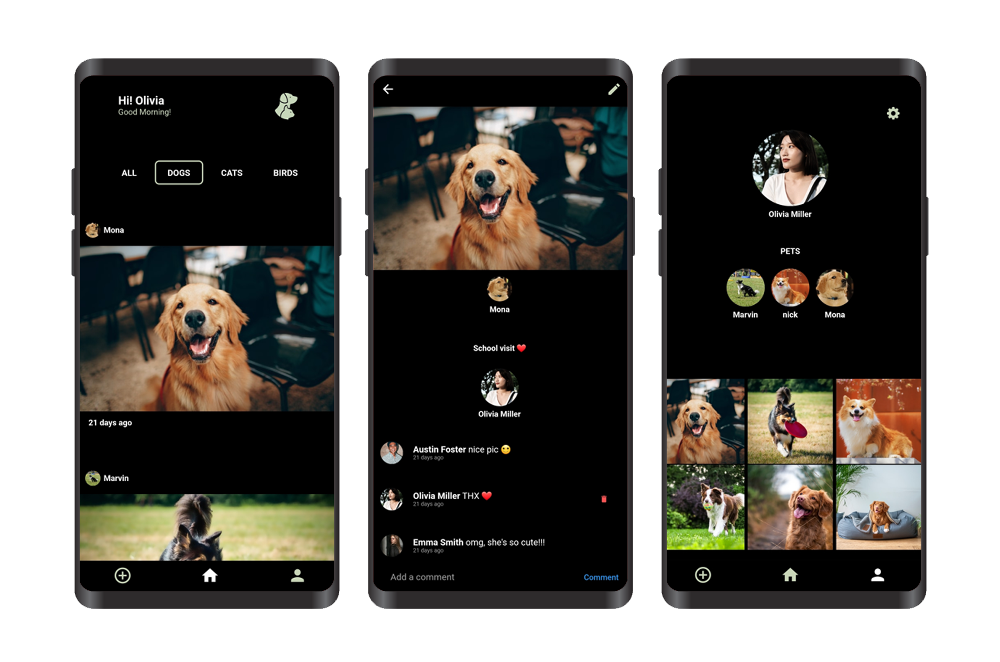
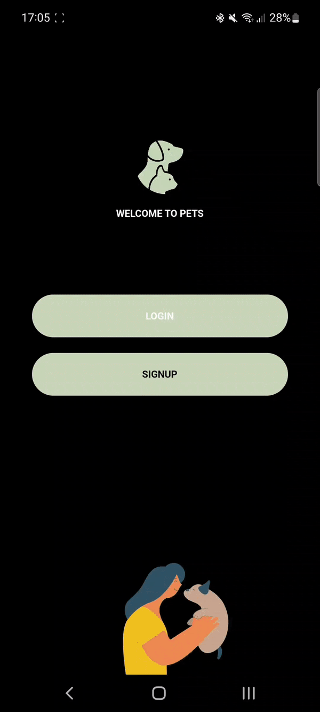

&nbsp;&nbsp;
&nbsp;&nbsp;
&nbsp;&nbsp;

# pets
### Pets is a Social Network App dedicated to all our pets. Pets allow you to interact with pet owners all around the world, sharing experiences and multimedia content such as photos and videos about your pets.

## Features
* Login / Sign Up
* Add / Edit Pet
* Add / Edit / Delete Post
* Add / Edit / Delete / Comment Post
* View / Edit Profile
* View Other User's Profile
* Filter Posts

## Dependencies

     
 Click to expand 

* [lottie](https://pub.dev/packages/lottie)
* [flutter_svg](https://pub.dev/packages/flutter_svg)
* [provider](https://pub.dev/packages/provider)
* [firebase_core](https://pub.dev/packages/firebase_core)
* [cloud_firestore](https://pub.dev/packages/cloud_firestore)
* [firebase_auth](https://pub.dev/packages/firebase_auth)
* [firebase_storage](https://pub.dev/packages/firebase_storage)
* [buttons_tabbar](https://pub.dev/packages/buttons_tabbar)
* [go_router](https://pub.dev/packages/go_router)
* [top_snackbar_flutter](https://pub.dev/packages/top_snackbar_flutter)
* [image_picker](https://pub.dev/packages/image_picker)
* [select_form_field](https://pub.dev/packages/select_form_field)
* [uuid](https://pub.dev/packages/uuid)
* [visibility_detector](https://pub.dev/packages/visibility_detector)
* [timeago](https://pub.dev/packages/timeago)

## App Demo
 

     AUTH
  

 
 &nbsp &nbsp &nbsp

  
