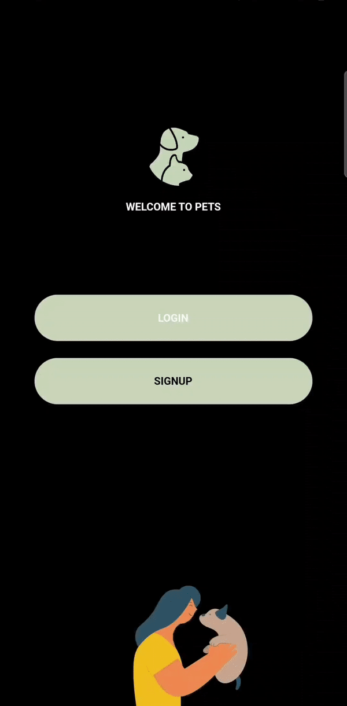

&nbsp;&nbsp;
&nbsp;&nbsp;
&nbsp;&nbsp;


# pets
### Pets is a Social Network App dedicated to all our pets. Pets allow you to interact with pet owners all around the world, sharing experiences and multimedia content such as photos and videos about your pets.


## Features
* Login / Sign Up
* Add / Edit Pet
* Add / Edit / Delete Post
* Add / Edit / Delete / Comment Post
* View / Edit Profile
* View Other User's Profile
* Filter Posts

## Dependencies
<details>
     <summary> Click to expand </summary>

* [lottie](https://pub.dev/packages/lottie)
* [flutter_svg](https://pub.dev/packages/flutter_svg)
* [provider](https://pub.dev/packages/provider)
* [firebase_core](https://pub.dev/packages/firebase_core)
* [cloud_firestore](https://pub.dev/packages/cloud_firestore)
* [firebase_auth](https://pub.dev/packages/firebase_auth)
* [firebase_storage](https://pub.dev/packages/firebase_storage)
* [buttons_tabbar](https://pub.dev/packages/buttons_tabbar)
* [go_router](https://pub.dev/packages/go_router)
* [top_snackbar_flutter](https://pub.dev/packages/top_snackbar_flutter)
* [image_picker](https://pub.dev/packages/image_picker)
* [select_form_field](https://pub.dev/packages/select_form_field)
* [uuid](https://pub.dev/packages/uuid)
* [visibility_detector](https://pub.dev/packages/visibility_detector)
* [timeago](https://pub.dev/packages/timeago)

</details>

## App Demo
 <p align="center">
     LOGIN / SIGN UP / PROFILE
  </p>

<p align="center">
 
 &nbsp &nbsp &nbsp

 &nbsp &nbsp &nbsp

</p>


 <p align="center">
     ADD PET / ADD POST / ADD COMMENT
  </p>

<p align="center">
 
 &nbsp &nbsp &nbsp

 &nbsp &nbsp &nbsp

</p>


## Directory Structure
<details>
     <summary> Click to expand </summary>

```
lib/
├── src/
│   ├── models/
│   │   ├── comment.dart
│   │   ├── pet.dart
│   │   └── post.dart
│   │   └── user.dart
│   ├── modules/
│   │   ├── add/
|   |   |   ├── controllers
|   |   |   |   ├── add_controller.dart
|   |   |   |   ├── add_pet_controller.dart
|   |   |   |   └── add_post_controller.dart
|   |   |   └── pages/
|   |   |       ├── add/
|   |   |       |   ├── widgets/
|   |   |       |   |   ├── add_body.dart
|   |   |       |   |   ├── go_add_pet.dart
|   |   |       |   |   ├── header_post.dart
|   |   |       |   |   └── pets_list.dart
|   |   |       |   └── add_page.dart
|   |   |       ├── addPet/
|   |   |       |   ├── widgets/
|   |   |       |   |   ├── add_pet_body.dart
|   |   |       |   |   ├── add_pet_button.dart
|   |   |       |   |   ├── add_photo_button.dart
|   |   |       |   |   ├── pet_form.dart
|   |   |       |   |   └── pet_photo.dart
|   |   |       |   └── add_pet_page.dart
|   |   |       └── addPost/
|   |   |           ├── widgets/
|   |   |           |   ├── add_post_body.dart
|   |   |           |   ├── add_post_button.dart
|   |   |           |   ├── add_post_form.dart
|   |   |           |   ├── pets_list_post.dart
|   |   |           |   └── pets.dart
|   |   |           └── add_post_page.dart
|   |   ├── auth/
|   |   |   ├── controllers
|   |   |   |   ├── login_controller.dart
|   |   |   |   └── sign_up_controller.dart
|   |   |   └── pages/
|   |   |       ├── login/
|   |   |       |   ├── widgets/
|   |   |       |   |   ├── already_have_an_account_check.dart
|   |   |       |   |   ├── login_body.dart
|   |   |       |   |   ├── login_button.dart
|   |   |       |   |   └── select_input_text.dart
|   |   |       |   └── login_page.dart
|   |   |       ├── signUp/
|   |   |       |   ├── widgets/
|   |   |       |   |   ├── or_divider.dart
|   |   |       |   |   ├── sign_up_body.dart
|   |   |       |   |   ├── sign_up_button.dart
|   |   |       |   |   └── social_icon.dart
|   |   |       |   └── sign_up_page.dart
|   |   |       └── welcome/
|   |   |           ├── widgets/
|   |   |           |   ├── bottom_animation.dart
|   |   |           |   └── welcome_body.dart
|   |   |           └── add_post_page.dart
|   |   ├── feed/
|   |   |   ├── controllers
|   |   |   |   ├── feed_controller.dart
|   |   |   |   └── post_controller.dart
|   |   |   └── pages/
|   |   |       ├── editPost/
|   |   |       |   ├── widgets/
|   |   |       |   |   ├── delete_post_button.dart
|   |   |       |   |   ├── edit_post_body.dart
|   |   |       |   |   └── edit_post_button.dart
|   |   |       |   └── edit_post_page.dart
|   |   |       ├── feed/
|   |   |       |   ├── widgets/
|   |   |       |   |   ├── post_card/
|   |   |       |   |   |   ├── pets_info.dart
|   |   |       |   |   |   └── post_card.dart
|   |   |       |   |   ├── feed_body.dart
|   |   |       |   |   ├── filter_posts_options.dart
|   |   |       |   |   ├── header_feed.dart
|   |   |       |   |   └── posts_list.dart
|   |   |       |   └── feed_page.dart
|   |   |       └── post/
|   |   |           ├── widgets/
|   |   |           |   ├── commets/
|   |   |           |   |   ├── bottom_navigation.dart
|   |   |           |   |   ├── comment_button.dart
|   |   |           |   |   ├── comment_card.dart
|   |   |           |   |   ├── delete_comment_button.dart
|   |   |           |   |   └── list_post_comments.dart
|   |   |           |   ├── description.dart
|   |   |           |   ├── edit_button.dart
|   |   |           |   └── post_body.dart
|   |   |           └── post_page.dart
|   |   ├── home/
|   |   |   └── pages/
|   |   |       └── home/
|   |   |           ├── widgets/
|   |   |           |   └── pages.dart
|   |   |           └── home_page.dart
|   |   └── profile/
|   |       ├── controllers
|   |       |   ├── edit_pet_controller.dart
|   |       |   ├── edit_user_controller.dart
|   |       |   ├── logout_controller.dart
|   |       |   ├── pet_page_controller.dart
|   |       |   └── profile_controller.dart
|   |       └── pages/
|   |           ├── pet/
|   |           |   ├── widgets/
|   |           |   |   ├── pet_info.dart
|   |           |   |   └── pet_page_body.dart
|   |           |   └── pet_page.dart
|   |           ├── profile/
|   |           |   ├── widgets/
|   |           |   |   ├── list_name.dart
|   |           |   |   ├── profile_body.dart
|   |           |   |   ├── profile_user_info.dart
|   |           |   |   ├── settings.dart
|   |           |   |   └── user_posts.dart
|   |           |   └── profile_page.dart
|   |           └── settings/
|   |               ├── editPet/
|   |               |   ├── editPet/
|   |               |   |   ├── widgets
|   |               |   |   |   ├── edit_pet_body.dart
|   |               |   |   |   ├── edit_pet_form.dart
|   |               |   |   |   ├── edit_pet_photo.dart
|   |               |   |   |   └── edit_pet_button.dart
|   |               |   |   └── edit_pet_page.dart
|   |               |   ├── PetsList/
|   |               |   |   ├── widgets
|   |               |   |   |   └── edit_pets_list_body.dart
|   |               |   |   └── edit_pets_list_page.dart
|   |               ├── editProfile/
|   |               |   ├── widgets/
|   |               |   |   ├── edit_profile_body.dart
|   |               |   |   ├── edit_profile_button.dart
|   |               |   |   ├── profile_name.dart
|   |               |   |   └── profile_photo.dart
|   |               |   └── edit_profile_page.dart
|   |               ├── settings/
|   |               |   ├── widgets/
|   |               |   |   ├── logout_button.dart
|   |               |   |   ├── settings_options.dart
|   |               |   |   └── settings_body.dart
|   |               └── settings_page.dart
│   ├── routes/
│   │   ├── app_router.dart
│   │   └── router_utils.dart
│   ├── services/
│   │   ├── auth/
│   │   |   └── auth_service.dart
│   │   ├── firestore/
│   │   |   └── firestore_service.dart
│   │   └── storage/
│   │       └── storage_service.dart
|   ├── shared/
│   │   ├── utils/
|   |   |   ├── constants.dart
|   |   |   ├── methods.dart
|   |   |   └── validator.dart
│   │   └── widgets
|   |       ├── input_description.dart
|   |       ├── input_text.dart
|   |       ├── list_images.dart
|   |       ├── logo.dart
|   |       ├── pets_list.dart
|   |       ├── rounded_button.dart
|   |       ├── rounded_input_password.dart
|   |       ├── rounded_input_text.dart
|   |       ├── text_field_container.dart
|   |       ├── profile_info.dart
|   |       └── profile_pets_avatar.dart
│   └── app_widget.dart
├── firebase_options.dart
└── main.dart
```

</details>
